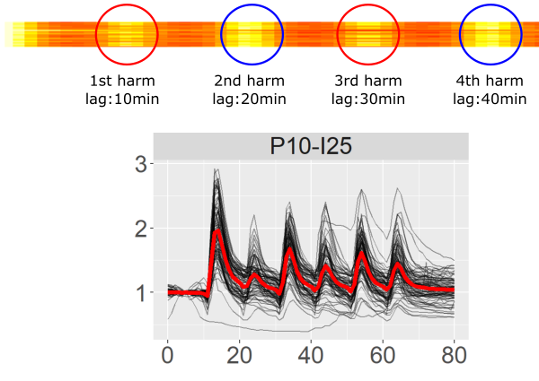

```{r setup, include=FALSE}
knitr::opts_chunk$set(echo = TRUE)
```

# Background and Objectives

Want to generate a matrix of perturbation with siRNA in the signalling network surrounding ERK response to GF. To analyze the induced perturbations, there's a need for a palette of measurements that will quantify features that can be seen "by eye". Such features can roughly be divided in 2 categories, the first one being features defined for a single condition (treatment):

* synhcrony of the cell response (correlation in time)
* robustness of the cell response (correlation in amplitude)
* "causality" how well do the cells follow the signal (correlation cell-signal)?

Others define features relative to 2 different treatmens:

* SMETS
* separability of responses snapshots (Bhattacharryya at each time point)


# Data presentation and normalization

```{r}
source("../rscripts/package.R")
rm(Yanni)
```

Data are coming from multipulse experiments which differs in the frequency of pulses and intensity of the pulse.

For convenience we define the following code to represent the treatment conditions: "PXX-IYY(-UO)"; where X represent the frequency of pulse, I its intensity and -UO indicates the presence of an ihibitor of MEK, a kinase upstream of ERK.

We now normalize the trajectories on a "per-trajectory" basis, using fold-change based on the 7 first minutes. We also cut the last 20min of measurement. 

```{r}
Cora <- myNorm(in.dt = Cora, in.meas.col = "Ratio", in.rt.min = 0, in.rt.max = 10, in.by.cols = c("Condition", "Label"), in.type = "fold.change")
Cora <- Cora[RealTime <= 80]
```

We also add 2 rows corresponding to 2 missing measurements:
```{r}
Cora <- rbind(Cora, list("P20-I25", "7_28", 14, 1.3, 1.7))
Cora <- rbind(Cora, list("P20-I25", "7_28", 33, 1.23, 1.6))
setkey(Cora, "Condition", "Label", "RealTime")
```

```{r echo = FALSE}
Cora
```


```{r cahe = T, fig.width=21, fig.height=12}
ggplot(Cora, aes(x=RealTime, y=Ratio.norm)) + geom_line(aes(group=Label), alpha = 0.4) + facet_wrap("Condition", scales = "free") + stat_summary(fun.y = mean, geom = "line",lwd=1.75, col = "red") + ggtitle("Per-trajectory normalized, fold change based on time [0, 10]") + theme(text = element_text(size = 25))
```

Cora noted there's an issue with the inhibitor UO, we should probably not consider these weird curves for now.

A rapid summary of these time-courses:

* With long-spaced pulses, the response typically appears as an exponential decay with well separated peaks.
* Increased pulse frequencies decrease the amplitudes of the peak until there's no peak anymore.
* P10-I25 seems to have an irregular behaviour on a 1-pulse time basis, but a regular one on a 2-pulse time basis.
* Light intensity seems to have a less important impact on the reponse, though a stronger light seems to lead to more regular oscillations.

------

# PCA

Remove the curves with UO for this analysis (big outliers).

```{r message=FALSE}
library(ggbiplot)
library(stringr)
cast.Cora <- dcast(Cora[!(Condition %in% c("P1-I100-UO", "P5-I100-UO", "P10-I100-UO", "P20-I100-UO"))], Condition + Label ~ RealTime , value.var = "Ratio.norm")
# Replace NA with finite values
for(j in 1:ncol(cast.Cora)){
  set(x = cast.Cora, i = which(is.na(cast.Cora[[j]])), j = j, value = 0.3)
}
pca.Cora <- prcomp(cast.Cora[,-c(1,2)], center = T, scale. = F)
cast.Cora$Pulse <- str_extract(string = unlist(cast.Cora[,1]), pattern = "^P[0-9]+")
cast.Cora$Intensity <- str_extract(string = unlist(cast.Cora[,1]), pattern = "I[0-9]+")
```

```{r fig.width=18, fig.height=12, warning=FALSE, cache=TRUE}
ggbiplot(pca.Cora, obs.scale = 1, var.scale = 1, 
              groups = unlist(cast.Cora[,1]), ellipse = TRUE, var.axes = F,
              circle = F) + theme(legend.direction = 'horizontal', 
              legend.position = 'top') + ggtitle('Colored on Condition') +
              theme(text = element_text(size = 25))

ggbiplot(pca.Cora, obs.scale = 1, var.scale = 1, 
              groups = unlist(cast.Cora[,84]), ellipse = TRUE, var.axes = F, 
              circle = F) + theme(legend.direction = 'horizontal', 
              legend.position = 'top') + ggtitle('Colored on Pulse') +
              theme(text = element_text(size = 25))

ggbiplot(pca.Cora, obs.scale = 1, var.scale = 1, 
              groups = unlist(cast.Cora[,85]), text = unlist(cast.Cora[,2]), ellipse = TRUE,  var.axes = F,
              circle = F) + theme(legend.direction = 'horizontal', 
              legend.position = 'top') + ggtitle('Colored on Intensity') +
              theme(text = element_text(size = 25))
```

Both first components separate on intensity and pulse. Interestingly, the I10 group is nicely clustered. This could indicate that robustness of signal with so little light is low.

```{r eval=F, echo=F}
plotly(ggbiplot(pca.Cora, obs.scale = 1, var.scale = 1, 
               groups = unlist(cast.Cora[,85]), ellipse = TRUE,  var.axes = F,
               circle = F))
```


------

# Synchrony measures

## Distance to mean

```{r fig.width=12}
distm.Cora <- dist_mean(Cora, "Condition", "RealTime", "Ratio", "Label")
ggplot(distm.Cora, aes(x=Condition, y=log(euclid_to_mean))) + geom_boxplot() + theme(text = element_text(size = 10)) + ggtitle("Log euclidean distance to mean trajectory - Raw data") + geom_boxplot(aes(fill=str_extract(Condition, "[0-9]+"))) + theme(legend.position="top")
```

Not very informative. Try with normalized data:

```{r fig.width=12}
distm.Cora <- dist_mean(Cora, "Condition", "RealTime", "Ratio.norm", "Label")
ggplot(distm.Cora, aes(x=Condition, y=log(euclid_to_mean))) + geom_boxplot() + theme(text = element_text(size = 10)) + ggtitle("Log euclidean distance to mean trajectory - Normalized data")+ geom_boxplot(aes(fill=str_extract(Condition, "[0-9]+"))) + theme(legend.position="top")
```

Conditions that were successfully inhibited by UO have a very low value because they are almost constant. The same holds for conditions with ligh intensity of 10, which are globally flat.

More than synchrony, it seems that the distance to the mean indicates the robustness of the response, variations in amplitude and not in time.


## Overlap of clipped and correlations

### Choice of k for rolling mean and overlap

Helper function to take a sample of trajectories in the provided condition, plot them along with their rolling means and clipped versions. Rolling mean is used when looking for overlap of clipped trajectories (clip = 1 if above rolling mean, 0 otherwise).

```{r}
# Visualize effect of clipping for choosing rolling mean window width
visualize.clip <- function(data, condition, meas.col, k, n = 6, cond.col = "Condition", lab.col = "Label", main = "Title"){
  # Pick n random trajectories
  samp <- sample(data[get(cond.col) == condition, get(lab.col)], size = n, replace = F)
  par(mfrow=c(2,3))
  for(i in samp){
    clipped <- wrap_clip(data[get(cond.col) == condition & get(lab.col) == i, get(meas.col)], k = k)
    clipped <- ifelse(clipped == 1, max(data[get(cond.col) == condition & get(lab.col) == i, get(meas.col)]),
                      min(data[get(cond.col) == condition & get(lab.col) == i, get(meas.col)]))
    plot(data[get(cond.col) == condition & get(lab.col) == i, get(meas.col)], type = "l", col = "red", lwd = 2, ylab = i, main = main)
    lines(rollex(data[get(cond.col) == condition & get(lab.col) == i, get(meas.col)], k = k), col = "darkgreen", lwd = 2, type ="l",      lty = "dashed")
    lines(clipped, col = "blue", lwd = 2, type ="s")
  }
}
```

An ideal rolling mean should cut oscillation in 2, and a relatively flat profile. A good rule of thumb for these datasets is to simply pick the pulse frequency as window width.

```{r message=F, fig.width=18}
# Not good since it follows the signal too closely (sensitive to noise)
visualize.clip(Cora, "P10-I100", "Ratio", 7, main = "Rolling mean window width 7 - Pulse 10")
# Good
visualize.clip(Cora, "P10-I100", "Ratio", 10, main = "Rolling mean window width 10 - Pulse 10")
# Not good, because the rollig mean starts to be in quadratic phase with signal
visualize.clip(Cora, "P10-I100", "Ratio", 13, main = "Rolling mean window width 13 - Pulse 10")
```

### Compute pairwise measures

The overlap of clipped trajectories, for conditions with pulse frequency of 1 isn't really relevant since they are not oscillatory.

```{r cache=T}
# Divide in 3 to take different widow width
pw.Cora.1 <- all_pairwise_stats(data = Cora[Condition %in% c("P1-I10","P1-I25","P1-I50","P1-I100","P1-I100-UO","P5-I10","P5-I25","P5-I50","P5-I100","P5-I100-UO")], condition = "Condition", label = "Label", measure = "Ratio", k_roll_mean = 5)
pw.Cora.2 <- all_pairwise_stats(data = Cora[Condition %in% c("P10-I10","P10-I25","P10-I50","P10-I100","P10-I100-UO")], condition = "Condition", label = "Label", measure = "Ratio", k_roll_mean = 10)
pw.Cora.3 <- all_pairwise_stats(data = Cora[Condition %in% c("P20-I10","P20-I25","P20-I50","P20-I100","P20-I100-UO")], condition = "Condition", label = "Label", measure = "Ratio", k_roll_mean = 20)

pw.Cora <- rbind(pw.Cora.1, pw.Cora.2, pw.Cora.3)
rm(pw.Cora.1, pw.Cora.2, pw.Cora.3)
```

```{r fig.width=21, fig.height=12}
temp <- melt(pw.Cora, id.vars = c("Condition","Label1", "Label2"))
ggplot(data = temp, aes(x=Condition, y = value)) + geom_boxplot() + facet_wrap("variable") + theme(text = element_text(size = 10)) + ggtitle("Pairwise measures of synchrony - Raw data") + geom_boxplot(aes(fill=str_extract(Condition, "[0-9]+"))) + theme(legend.position="top")
```

Conditions with pulse frequency of 1, still have a high correlation. Conditions with low light intensity display poor robustness. Overlap globally shows the same trends, but with tighter distributions.

Overlap of clipped trajectory has an advantage over distance to mean and correlations: it detects also trajectories that are highly correlated but almost flat.

Repeat with normalized ratios:

```{r cache=T, echo=F}
# Divide in 3 to take different widow width
pw.Cora.1 <- all_pairwise_stats(data = Cora[Condition %in% c("P1-I10","P1-I25","P1-I50","P1-I100","P1-I100-UO","P5-I10","P5-I25","P5-I50","P5-I100","P5-I100-UO")], condition = "Condition", label = "Label", measure = "Ratio.norm", k_roll_mean = 5)
pw.Cora.2 <- all_pairwise_stats(data = Cora[Condition %in% c("P10-I10","P10-I25","P10-I50","P10-I100","P10-I100-UO")], condition = "Condition", label = "Label", measure = "Ratio.norm", k_roll_mean = 10)
pw.Cora.3 <- all_pairwise_stats(data = Cora[Condition %in% c("P20-I10","P20-I25","P20-I50","P20-I100","P20-I100-UO")], condition = "Condition", label = "Label", measure = "Ratio.norm", k_roll_mean = 20)

pw.norm.Cora <- rbind(pw.Cora.1, pw.Cora.2, pw.Cora.3)
rm(pw.Cora.1, pw.Cora.2, pw.Cora.3)
```

```{r fig.width=21, fig.height=12, echo = F}
temp <- melt(pw.norm.Cora, id.vars = c("Condition","Label1", "Label2"))
ggplot(data = temp, aes(x=Condition, y = value)) + geom_boxplot() + facet_wrap("variable") + theme(text = element_text(size = 10)) + ggtitle("Pairwise measures of synchrony - Normalized data") + geom_boxplot(aes(fill=str_extract(Condition, "[0-9]+"))) + theme(legend.position="top")
```

Results are vastly identical (100% indentical for Overlap).

------

# Amplitude difference measures

## Distance to individual rolling means

```{r}
amp.Cora.1 <- amplitude_oscillations(data = Cora[Condition %in% c("P1-I10","P1-I25","P1-I50","P1-I100","P1-I100-UO","P5-I10","P5-I25","P5-I50","P5-I100","P5-I100-UO")], condition = "Condition", label = "Label", measure = "Ratio", k_roll_mean = 5)
amp.Cora.2 <- amplitude_oscillations(data = Cora[Condition %in% c("P10-I10","P10-I25","P10-I50","P10-I100","P10-I100-UO")], condition = "Condition", label = "Label", measure = "Ratio", k_roll_mean = 10)
amp.Cora.3 <- amplitude_oscillations(data = Cora[Condition %in% c("P20-I10","P20-I25","P20-I50","P20-I100","P20-I100-UO")], condition = "Condition", label = "Label", measure = "Ratio", k_roll_mean = 20)

amp.Cora <- rbind(amp.Cora.1, amp.Cora.2, amp.Cora.3)
rm(amp.Cora.1, amp.Cora.2, amp.Cora.3)
```

```{r fig.width=12}
temp <- melt(amp.Cora, id.vars = c("Condition","Label"))
ggplot(data = temp, aes(x=Condition, y = log(value))) + geom_boxplot() + theme(text = element_text(size = 10)) + ggtitle("Amplitude variation, distance to individual rolling mean - Raw data") + geom_boxplot(aes(fill=str_extract(Condition, "[0-9]+"))) + theme(legend.position="top")
```

Repeat with normalized data:

```{r echo = FALSE}
amp.Cora.1 <- amplitude_oscillations(data = Cora[Condition %in% c("P1-I10","P1-I25","P1-I50","P1-I100","P1-I100-UO","P5-I10","P5-I25","P5-I50","P5-I100","P5-I100-UO")], condition = "Condition", label = "Label", measure = "Ratio.norm", k_roll_mean = 5)
amp.Cora.2 <- amplitude_oscillations(data = Cora[Condition %in% c("P10-I10","P10-I25","P10-I50","P10-I100","P10-I100-UO")], condition = "Condition", label = "Label", measure = "Ratio.norm", k_roll_mean = 10)
amp.Cora.3 <- amplitude_oscillations(data = Cora[Condition %in% c("P20-I10","P20-I25","P20-I50","P20-I100","P20-I100-UO")], condition = "Condition", label = "Label", measure = "Ratio.norm", k_roll_mean = 20)

amp.norm.Cora <- rbind(amp.Cora.1, amp.Cora.2, amp.Cora.3)
rm(amp.Cora.1, amp.Cora.2, amp.Cora.3)
```

```{r fig.width=12, echo = FALSE}
temp <- melt(amp.norm.Cora, id.vars = c("Condition","Label"))
ggplot(data = temp, aes(x=Condition, y = log(value))) + geom_boxplot() + theme(text = element_text(size = 10)) + ggtitle("Amplitude variation, distance to individual rolling mean - Normalized data") + geom_boxplot(aes(fill=str_extract(Condition, "[0-9]+"))) + theme(legend.position="top")
```

The trends are the expected ones, but the measure is somehow biased by the different number of peaks!

## Time series decomposition

Time series can be decomposed in 3 terms: trend-cyclicity, seasonality and remainder. Cyclicity appears when a variation is determined by a fixed period, it is thus included with the trend. In contrast seasonality appears at a non-fixed period. 

The distance to individual rolling mean, is acutally like a crude form of seasonality extraction and the rolling mean being a way to extract the trend. We'll try to use time series decomposition to get the amplitude of the seasonality.

For now we will assume only additive decomposition.

### Decomposition choice

#### Classical decomposition

https://www.otexts.org/fpp/6/3

Actually the following workflow is already implemented in R! See ?decompose.

Steps are:

* We get the trend using our function of rolling mean with linear interpolation at the extremities.
* Detrend series by subtracting trend.
* Average every ith point of an oscillation to get seasonal effect for the ith part of the oscillation.
* Center seasonal value.
* Get remainder.

```{r}
source("../rscripts/classical_decomposition.R")
Cora.short <- Cora[RealTime >= 10 & RealTime <= 70]
```

A couple of examples:

```{r}
traj <- Cora.short[.("P10-I100", "2_1"), Ratio.norm]
temp <- classical.decomposition(ts = traj, frequency = 10, robust = T)
plot.decomposition(traj, temp, "Data, P10-I100, 2_1")
max(temp[,"seasonal"]) - min(temp[,"seasonal"])
```

The seasonal component looks like an exponential decay. The decomposition approach takes in account the slight collapsing of the trend in the last time points by averaging (effectively using median) to reconstruct the seasonal component. The error term is mostly localized around the first oscillation.

```{r, echo = F}
traj <- Cora.short[.("P5-I100", "2_1"), Ratio.norm]
temp <- classical.decomposition(ts = traj, frequency = 5, robust = T)
plot.decomposition(traj, temp, "Data , P5-I100, 2_1")
max(temp[,"seasonal"]) - min(temp[,"seasonal"])
```

The seasonal component looks like a sinusoid. The amplitude in seasonal is indeed smaller than the one observed in the previous series.

```{r, echo = F}
traj <- Cora.short[.("P20-I100", "2_1"), Ratio.norm]
temp <- classical.decomposition(ts = traj, frequency = 20, robust = T)
plot.decomposition(traj, temp, "Data, P20-I100, 2_1")
max(temp[,"seasonal"]) - min(temp[,"seasonal"])
```


```{r, echo = F}
traj <- Cora.short[.("P1-I100", "2_1"), Ratio.norm]
temp <- classical.decomposition(ts = traj, frequency = 2, robust = T)
plot.decomposition(traj, temp, "Data , P1-I100, 2_1")
max(temp[,"seasonal"]) - min(temp[,"seasonal"])
```

The decomposition is impossible to use with frequency 1.

#### STL decomposition

A more advanced decomposition is the so-called "Seasonal and Trend decomposition using Loess" (see https://www.otexts.org/fpp/6/5 ).

When converting the data to time series object, we indicate the frequency in pulse time units. So if there's one pulse evry 10min, and measurements are performed every 1min, frequency is 10. 

A series with relatively large oscillation amplitude:
```{r}
traj <- ts(Cora.short[.("P10-I100", "2_1"), Ratio.norm], frequency = 10)
fit <- stl(x = traj, s.window ="periodic", t.window = NULL, robust=T)
plot(fit)
# Amplitude of the seasonal component
max(fit$time.series[,"seasonal"]) - min(fit$time.series[,"seasonal"])
```

A series with relatively small oscillation amplitude:
```{r}
traj <- ts(Cora.short[.("P5-I100", "2_1"), Ratio.norm], frequency = 5)
fit <- stl(x = traj, s.window = "periodic", t.window = NULL, robust=T)
plot(fit)
# Amplitude of the seasonal component
max(fit$time.series[,"seasonal"]) - min(fit$time.series[,"seasonal"])
```

```{r}
traj <- ts(Cora.short[.("P20-I100", "2_1"), Ratio.norm], frequency = 20)
fit <- stl(x = traj, s.window = "periodic", t.window = NULL, robust=T)
plot(fit)
# Amplitude of the seasonal component
max(fit$time.series[,"seasonal"]) - min(fit$time.series[,"seasonal"])
```


Results are very similar with the homemade classical decomposition and STL. The best for now is probably to stick to homemade since it is simpler with less parameters. Though STL probably does a better job at estimating the trend is case like P20.


### Assess amplitude of oscillations with seasonal amplitude

Time series decomposition becomes very handy here, as we can just extract the amplitude of seasonal component oscillation.

```{r}
wrap_amplitude <- function(ts, frequency, robust = T){
  frequency <- unique(frequency)
  if(frequency == 1) return(0)
  temp <- classical.decomposition(ts, frequency, robust)
  return(max(temp[,"seasonal"]) - min(temp[,"seasonal"]))
}

Cora.short[, pulse.freq := as.numeric(str_extract(Condition, "[0-9]+"))]
amp.season.Cora <- Cora.short[, .(amplitude.season = wrap_amplitude(Ratio.norm, pulse.freq)), by = c("Condition", "Label")]
```

```{r fig.width=14}
ggplot(amp.season.Cora, aes(x=Condition, y =amplitude.season)) + geom_boxplot(aes(fill=str_extract(Condition, "[0-9]+"))) + theme(legend.position="top")
```

This metric seems to work much better than the distance to individual rolling means. Amplitude of oscillations increases steadily with light intensity, except for P20 where maximal intensity actually decreases a bit the amplitude of the oscillation compared to the second max intensity.

A big drawback of the method is that we need at least 2 measures between each cycle. Since we cannot give an estimation of oscillation amplitude (if any) for P1.

### Using rolling mean before trimming for trend estimation

The classical_decomposition used in the previous section estimates the trend using a rolling mean extended with linear interpolation. But in our case we can get rid of the interpolation which inherently introduces some error, by directly passing the rolling mean as a trend:

```{r warning=F}
modified.decomposition <- function(ts, trend, frequency, robust = T){
  if(!exists("rollex", mode="function")) source("./overlap_clipping.R")
  detrend <- ts - trend
  seasonal <- rep(NA, length(ts))
  if(robust){
    for(i in 1:frequency){
      index <- seq(i, length(ts), by = frequency)
      seasonal[index] <- median(detrend[index])
    } 
  } else {
    for(i in 1:frequency){
      index <- seq(i, length(ts), by = frequency)
      seasonal[index] <- mean(detrend[index])
    }
  }
  seasonal <- scale(seasonal, center = T, scale = F)
  return(max(seasonal) - min(seasonal))
}

Cora[, trend := rollex(Ratio.norm, k = as.numeric(str_extract(Condition, "[0-9]+"))), by = c("Condition", "Label")]
Cora.short <- Cora[RealTime >= 10 & RealTime <= 70]
mod.season.Cora <- Cora.short[, .(amplitude.season = modified.decomposition(Ratio.norm, trend, as.numeric(str_extract(Condition, "[0-9]+")))), by = c("Condition", "Label")]
Cora[, trend := NULL]
```

```{r fig.width=14}
ggplot(mod.season.Cora, aes(x=Condition, y =amplitude.season)) + geom_boxplot(aes(fill=str_extract(Condition, "[0-9]+"))) + theme(legend.position="top")
```

The difference between calculating the trend prior to trim time and after trimming is negligible.


## Use remainder to detect variation in oscillation amplitude

Seasonality is of forced fixed amplitude, and thus the trend should correct for offset such that the fit follows the signal as closely as possible. However since seasonality amplitude is fixed, there is a remainder, we can extract some statistics out of this remainders to get an idea about the variation around the seasonal amplitude. This characterizes an excess or a deficit of the (seasonality+trend).

```{r}
wrap_amplitude_variation <- function(ts, frequency, robust = T){
  frequency <- unique(frequency)
  if(frequency == 1) return(0)
  temp <- classical.decomposition(ts, frequency, robust)
  return(mean(temp[,"remainder"]))
}

Cora.short[, pulse.freq := as.numeric(str_extract(Condition, "[0-9]+"))]
amp.variation.season.Cora <- Cora.short[, .(mean.remainder = wrap_amplitude_variation(Ratio.norm, pulse.freq), RealTime), by = c("Condition", "Label")]
```

```{r}
ggplot(amp.variation.season.Cora, aes(x=Condition, y =mean.remainder)) + geom_boxplot(aes(fill=str_extract(Condition, "[0-9]+"))) + theme(legend.position="top") + ggtitle("Mean remainder after time series decomposition")
```

Positive or negative remainder depend on which amplitude the seasonality has been "tuned on". Imagine there are 2 peaks of large amplitudes, versus 20 peaks of small amplitude: the robust estimation of seasonality will get calibrated to the small amplitude. Therefore the remainders for the large peaks will be positive and zero for the small ones. Now imagine there are 20 large peaks and 2 small ones, the remainders for the large peaks will be zero and negative for the small ones. This is visible for the series P20 on the heatmap, where the first peak is slightly higher than the 2 next ones, thus dampened down in a larger extend than the two other peaks are taken up.

```{r fig.with = 14, cache=T}
wrap_amplitude_variation <- function(ts, frequency, robust = T){
  frequency <- unique(frequency)
  if(frequency == 1) return(0)
  temp <- classical.decomposition(ts, frequency, robust)
  return(temp[,"remainder"])
}

temp <- Cora.short[, .(remainder = wrap_amplitude_variation(Ratio.norm, pulse.freq), RealTime), by = c("Condition", "Label")]
temp <- dcast(temp, Condition + Label ~ RealTime ,value.var = "remainder")
breakpoints <- unique(temp[,Condition])
breakpoints <- sapply(breakpoints, function(x) max(which(temp[, Condition] == x)))
col.pulse <- str_extract(as.character(temp[,Condition]), "P[0-9]+")
col.pulse <- str_replace(string = col.pulse, pattern = "^P1$", replacement = "blue")
col.pulse <- str_replace(string = col.pulse, pattern = "^P5$", replacement = "red")
col.pulse <- str_replace(string = col.pulse, pattern = "^P10$", replacement = "green")
col.pulse <- str_replace(string = col.pulse, pattern = "^P20$", replacement = "yellow")
library(gplots)
mybreaks <- c(min(temp[,-c(1,2)]), -0.25, -0.10, 0.10, 0.25, max(temp[,-c(1,2)]))
mypal <-  RColorBrewer::brewer.pal(5, name="Spectral")
heatmap.2(as.matrix(temp[,-c(1,2)]), Colv = F, Rowv = F, colRow = col.pulse, dendrogram = "none", trace="none", rowsep = breakpoints, sepwidth = c(5,5), main = "Remainder (excess/deficit seasonality) \n Blue: P1; Red: P5; Green: P10, Yellow: P20 \n Breaks indicate different light intensities", xlab = "Time", ylab = "Trajectories", key = T, col = mypal, breaks = mybreaks, lwid = c(0.75, 4.5))
```

We see that the first peak concentrates most of the remainders, this is to be expected since it is consistently the largest peak in every condition. The second peaks in conditions P10 also display large remainder, but also at each peak the remainders are globally larger than for other conditions, this is coherent with the fact the biggest amplitude in oscillation are seen for P10.

To simplify a bit the interpretation and get relevant statistics out of it, we consider only remainders of 5% or more and use absolute values.

```{r}
temp <- Cora.short[, .(remainder = wrap_amplitude_variation(Ratio.norm, pulse.freq), RealTime), by = c("Condition", "Label")]
temp <- temp[remainder > 0.05 | remainder < 0.05]
temp[, remainder := abs(remainder)]
temp <- temp[, .(clipped.mean.remainder = mean(remainder)), by = c("Condition", "Label")]
ggplot(temp, aes(x=Condition, y = clipped.mean.remainder)) + geom_boxplot(aes(fill=str_extract(Condition, "[0-9]+"))) + theme(legend.position="top") + ggtitle("Mean of clipped remainder after time series decomposition")
```

Same conclusions are coming here, except that this metric seems more convenient than the previous ones: distribution of positive values, relatively small variance, and quite a good dispersion between conditions.

------

# Detect cyclic pattern - Autocorrelation - Height of spectrum power peak at pulse frequency

Spectral density (which composes the power spectrum) is equivalent to autocorrelation in frequency space; the same way as coherence is equivalent to cross-correlation.

Number of pulse time to get max autocorrelation? For this analysis we will harshly trim the time series to keep only the oscillatory parts.

```{r}
Cora.short <- Cora[RealTime >= 10 & RealTime <= 70]
```

## Autocorrelations of raw data
 
### Autocorrelation at harmonic time only

```{r}
get.ac.harmonics <- function(ts, f0, plot = F, lag.max = 1e6, ...){
  # Return autocorrelation values only at harmonics (i.e. multiple of f0)
  # Get autocorrelation
  temp <- acf(ts, plot = plot, lag.max = lag.max, ...)
  # Which lag are multiple of f0?
  lags <- which(temp$lag %% f0 == 0)
  return(list(acf = temp$acf[lags], lag = temp$lag[lags]))
}

acf.Cora.1 <- Cora.short[, .(acf = get.ac.harmonics(Ratio, f0 = as.integer(str_extract(Condition, "[0-9]+")))$acf), by = c("Condition", "Label")]
acf.Cora.2 <- Cora.short[, .(lag = get.ac.harmonics(Ratio, f0 = as.integer(str_extract(Condition, "[0-9]+")))$lag), by = c("Condition", "Label")]
acf.harm.Cora <- cbind(acf.Cora.1, acf.Cora.2[,3])
rm(acf.Cora.1, acf.Cora.2)

acf.harm.Cora[, harmonic.number := (seq_along(lag)-1), by = c("Condition", "Label")]
```

```{r fig.width=21, fig.height=12, cache=T}
ggplot(acf.harm.Cora[harmonic.number %in% 0:5], aes(x=harmonic.number, y=acf)) + geom_line(aes(group=Label), alpha = 0.2) + facet_grid(Condition ~.) + theme(text = element_text(size = 10))
```

Get a difference between first and second harmonics?

### Autocorrelation at all lags

```{r}
get.ac.all <- function(ts, plot = F, lag.max = 1e6, ...){
  # Return autocorrelation at all all lags
  temp <- acf(ts, plot = plot, lag.max = lag.max, ...)
  return(list(acf = as.vector(temp$acf), lag = as.vector(temp$lag)))
}

acf.Cora.1 <- Cora.short[, .(acf = get.ac.all(Ratio)$acf), by = c("Condition", "Label")]
acf.Cora.2 <- Cora.short[, .(lag = get.ac.all(Ratio)$lag), by = c("Condition", "Label")]
acf.all.Cora <- cbind(acf.Cora.1, acf.Cora.2[,3])
rm(acf.Cora.1, acf.Cora.2)
```

```{r fig.width=21, fig.height=12, cache=T}
ggplot(acf.all.Cora, aes(x=lag, y=acf)) + geom_line(aes(group=Label), alpha = 0.2) + facet_grid(Condition ~.) + theme(text = element_text(size = 10))
```

```{r message=F}
library(gplots)
par(cex.main=0.75)
temp <- dcast(acf.all.Cora, Condition + Label ~ lag ,value.var = "acf")
breakpoints <- unique(temp[,Condition])
breakpoints <- sapply(breakpoints, function(x) max(which(temp[, Condition] == x)))
col.pulse <- str_extract(as.character(temp[,Condition]), "P[0-9]+")
col.pulse <- str_replace(string = col.pulse, pattern = "^P1$", replacement = "blue")
col.pulse <- str_replace(string = col.pulse, pattern = "^P5$", replacement = "red")
col.pulse <- str_replace(string = col.pulse, pattern = "^P10$", replacement = "green")
col.pulse <- str_replace(string = col.pulse, pattern = "^P20$", replacement = "yellow")
heatmap.2(as.matrix(temp[,-c(1,2)]), Colv = F, Rowv = F, colRow = col.pulse, dendrogram = "none", trace="none", rowsep = breakpoints, sepwidth = c(5,5), main = "Autocorrelations of raw data \n Blue: P1; Red: P5; Green: P10, Yellow: P20 \n Breaks indicate different light intensities", xlab = "Lag", ylab = "Trajectories", key = F)
```

Note that this heatmap is the equivalent of a power spectrum in the time space.

### Auto-correlations after circularization of signal

Using cross-correlation on circularised signal:

```{r message=F}
source("../rscripts/circular_cross_correlation.R")

circular.all.Cora <- Cora.short[, .(circ.cc = circular.cc(Ratio, Ratio)), by = c("Condition","Label")]
circular.all.Cora[, lag := (seq_along(circ.cc) - 1), by =  c("Condition","Label")]
```

```{r echo=F}
temp <- dcast(circular.all.Cora, Condition + Label ~ lag ,value.var = "circ.cc")
breakpoints <- unique(temp[,Condition])
breakpoints <- sapply(breakpoints, function(x) max(which(temp[, Condition] == x)))
col.pulse <- str_extract(as.character(temp[,Condition]), "P[0-9]+")
col.pulse <- str_replace(string = col.pulse, pattern = "^P1$", replacement = "blue")
col.pulse <- str_replace(string = col.pulse, pattern = "^P5$", replacement = "red")
col.pulse <- str_replace(string = col.pulse, pattern = "^P10$", replacement = "green")
col.pulse <- str_replace(string = col.pulse, pattern = "^P20$", replacement = "yellow")
par(cex.main=0.75)
heatmap.2(as.matrix(temp[,-c(1,2)]), Colv = F, Rowv = F, colRow = col.pulse, dendrogram = "none", trace="none", rowsep = breakpoints, sepwidth = c(5,5), main = "Autocorrelations of CIRCULARISED raw data  \n Blue: P1; Red: P5; Green: P10, Yellow: P20 \n Breaks indicate different light intensities", xlab = "Lag", ylab = "Trajectories", key = F)
```

Note that for the last lag value, correlation gets back to 1 since it is equivalent to a lag of zero.

In all these previous plots, it appears clearly that pulsing every minute do not lead to any kind of periodicity. On the other hand, harmonics (multiple of pulse time) do indeed have a good autocorrelation for the other conditions.

## Autocorrelations of normalized data

Sanity check: should be the same as unormalized.

### Autocorrelation at all lags

Using normalized data:

```{r echo=F}
acf.Cora.1 <- Cora.short[, .(acf = get.ac.all(Ratio.norm)$acf), by = c("Condition", "Label")]
acf.Cora.2 <- Cora.short[, .(lag = get.ac.all(Ratio.norm)$lag), by = c("Condition", "Label")]
acf.all.Cora <- cbind(acf.Cora.1, acf.Cora.2[,3])
rm(acf.Cora.1, acf.Cora.2)

temp <- dcast(acf.all.Cora, Condition + Label ~ lag ,value.var = "acf")
breakpoints <- unique(temp[,Condition])
breakpoints <- sapply(breakpoints, function(x) max(which(temp[, Condition] == x)))
col.pulse <- str_extract(as.character(temp[,Condition]), "P[0-9]+")
col.pulse <- str_replace(string = col.pulse, pattern = "^P1$", replacement = "blue")
col.pulse <- str_replace(string = col.pulse, pattern = "^P5$", replacement = "red")
col.pulse <- str_replace(string = col.pulse, pattern = "^P10$", replacement = "green")
col.pulse <- str_replace(string = col.pulse, pattern = "^P20$", replacement = "yellow")
par(cex.main=0.75)
heatmap.2(as.matrix(temp[,-c(1,2)]), Colv = F, Rowv = F, colRow = col.pulse, dendrogram = "none", trace="none", rowsep = breakpoints, sepwidth = c(5,5), main = "Autocorrelations of normalized data \n Blue: P1; Red: P5; Green: P10, Yellow: P20 \n Breaks indicate different light intensities", xlab = "Lag", ylab = "Trajectories", key = F)
```

### Auto-correlations after circularization of signal

```{r echo=F}
circular.all.Cora <- Cora.short[, .(circ.cc = circular.cc(Ratio.norm, Ratio.norm)), by = c("Condition","Label")]
circular.all.Cora[, lag := (seq_along(circ.cc) - 1), by =  c("Condition","Label")]

temp <- dcast(circular.all.Cora, Condition + Label ~ lag ,value.var = "circ.cc")
breakpoints <- unique(temp[,Condition])
breakpoints <- sapply(breakpoints, function(x) max(which(temp[, Condition] == x)))
col.pulse <- str_extract(as.character(temp[,Condition]), "P[0-9]+")
col.pulse <- str_replace(string = col.pulse, pattern = "^P1$", replacement = "blue")
col.pulse <- str_replace(string = col.pulse, pattern = "^P5$", replacement = "red")
col.pulse <- str_replace(string = col.pulse, pattern = "^P10$", replacement = "green")
col.pulse <- str_replace(string = col.pulse, pattern = "^P20$", replacement = "yellow")
par(cex.main=0.75)
heatmap.2(as.matrix(temp[,-c(1,2)]), Colv = F, Rowv = F, colRow = col.pulse, dendrogram = "none", trace="none", rowsep = breakpoints, sepwidth = c(5,5), main = "Autocorrelations of CIRCULARISED normalized data  \n Blue: P1; Red: P5; Green: P10, Yellow: P20 \n Breaks indicate different light intensities", xlab = "Lag", ylab = "Trajectories", key = F)
```


Looking at these heatmaps, we see especially for conditions P5 and P10 that the 1st harmonic (at time 5 and 10min resp.) is globally not as strong as the 2nd (at time 10 and 20min resp.).

## Autocorrelation ratio at harmonics 1, 2 and 3

Now, we would like to see the evolution of harmonics intensities, for example in conditions pulsed every 5 or 10min, it seems that taking 2 pulse times into account would return a higher autocorrelation than 1 pulse time.



```{r fig.width=14, fig.height=21}
get.circc.harmonics <- function(ts, f0, plot = F, lag.max = 1e6, ...){
  # Return autocorrelation values only at harmonics (i.e. multiple of f0) (circular cross-correlation)
  # Get autocorrelation
  temp <- circular.cc(ts, ts)
  # lags
  names(temp) <- seq_along(temp) - 1
  # Which lag are multiple of f0?
  lags <- which(as.numeric(names(temp)) %% f0 == 0)
  return(temp[lags])
}

harm.circc.Cora <- Cora.short[, .(circ.cc = get.circc.harmonics(Ratio, f0 = as.integer(str_extract(Condition, "[0-9]+")))), by = c("Condition", "Label")]
harm.circc.Cora[, harmonic.number := (seq_along(circ.cc)-1), by = c("Condition", "Label")]


ggplot(harm.circc.Cora[harmonic.number %in% 1:3], aes(x=as.factor(harmonic.number), y=circ.cc)) +
  geom_line(aes(group=Label), alpha = 0.2) +
  geom_point() +
  stat_summary(fun.y=mean, colour="red", geom="point", aes(group=Condition)) +
  stat_summary(fun.y=mean, colour="red", geom="line", aes(group=Condition)) +
  facet_grid(Condition ~.) + theme(text = element_text(size = 25)) +
  ggtitle("Evolution of autocorrelation at lags corresponding to pulse time harmonics")
```

Get ratios, first add one to every correlations to avoid negative ratio:

```{r}
temp <- harm.circc.Cora[harmonic.number %in% 1:3, ]
temp <- dcast(temp, Condition + Label ~ harmonic.number, value.var = "circ.cc")
setnames(temp, c("1", "2", "3"), make.names(1:3))
temp[, c("X1", "X2", "X3") := list(X1+1, X2+1, X3+1)]
temp$Ratio.1.2 <- temp$X1 / temp$X2
temp$Ratio.1.3 <- temp$X1 / temp$X3
```

```{r fig.width=14}
ggplot(temp, aes(x=Condition, y=Ratio.1.2)) + geom_boxplot() + ggtitle("Autocorrelation 1st harmonics / 2nd harmonics") + geom_hline(yintercept = 1, col = 'red', lty = 'dashed') + geom_boxplot(aes(fill=str_extract(Condition, "[0-9]+"))) + theme(legend.position="top")
```

For conditions P5-I25, P5-I50 and P10-I25, the second harmonics usually present a higher autocorrelation value. This is coherent with the observation of the time series mean, in which we see an alternance of "a big" and "a small" wave in these conditions.

Compare with power spectrum:
```{r fig.height=8}
par(mfrow=c(2,1))
plot(Cora[.("P5-I25", "6_20"), Ratio], type="l", ylab = "Ratio", xlab= "Time")
spectrum(Cora[.("P5-I25", "6_20"), Ratio])
```

Time period of 5min (1 harmonics) corresponds to a frequency of 0.2, time period of 10min (2 harmonics) corresponds to a frequency of 0.1. Here we see that both peaks are sensibly at the same height. This could be because these power analysis, in difference with the autocorrelation ratio, do not take only 2 periods in account but all of them.

```{r fig.width=14}
ggplot(temp, aes(x=Condition, y=Ratio.1.3)) + geom_boxplot() + ggtitle("Autocorrelation 1st harmonics / 3rd harmonics") + geom_hline(yintercept = 1, col = 'red', lty = 'dashed') + geom_boxplot(aes(fill=str_extract(Condition, "[0-9]+"))) + theme(legend.position="top")
```

We don't observe any third order pattern here (except for conditions P20, but it's not relevant since there is only 3 oscillations in the data for these conditions).

Try further:

* As 1st peak is always a lot larger, could repeat without it. 
* The problem of even and odd number of peaks when there is a tandem of peak, could try to isolate 1/2 oscillations and to use only this as a template.
* Statistics for the ratio, significantly different from 1?
* To get closer to power spectrum analysis, instead of computing the ratio of 1st and 2nd harmonics only, could take one by one all harmonics and divide by the next one, get a mean ratio out of that? Could similarly be extended to harmonics 3...

------

# Extract global features

## Local maxima detection

Will be useful for a couple of metrics tested afterwards:

```{r}
detect.maxima <- function(x, window.size){
  require(zoo)
  if(window.size %% 2 == 0) stop("window size must be odd")
  middle <- ceiling(window.size / 2)
  xz <- as.zoo(x)
  out <- rollapply(x, window.size, function(x) which.max(x) == middle)
  out <- c(rep(NA, middle-1), out, rep(NA, middle-1))
  return(out)
}

detect.minima <- function(x, window.size){
  require(zoo)
  if(window.size %% 2 == 0) stop("window size must be odd")
  middle <- ceiling(window.size / 2)
  xz <- as.zoo(x)
  out <- rollapply(x, window.size, function(x) which.min(x) == middle)
  out <- c(rep(NA, middle-1), out, rep(NA, middle-1))
  return(out)
}
  
x <- sin(seq(0,25,0.1))
plot(x)
abline(v = which(detect.maxima(x, 7)), col = 'red', lty = 'dashed')
abline(v = which(detect.minima(x, 7)), col = 'blue', lty = 'dashed')
```

Easily modified to have a minimal span between 2 maxima/minima.

## Long trend linear regression

We can use the trend of time series decomposition for this, remember that it is simply a moving average that is extended by linear interpolation. In other words, this is a linear regression of deseasonalized data.

One way to get a single number out of this trend is to perform a linear regression of it and to get the slope coefficient out. Notice that we don't care that much about the quality of the regression and use it purely as a descriptive mean. Actually autocorrelation in these series introduces autocorrelation in the residuals, which is a violation of the model assumptions. 

```{r warning=F}
Cora[, trend := rollex(Ratio.norm, k = as.numeric(str_extract(Condition, "[0-9]+"))), by = c("Condition", "Label")]
Cora.short <- Cora[RealTime >= 10 & RealTime <= 70]
```

```{r}
wrap_regression <- function(traj, time){
  fit <- lm(traj ~ time)
  return(list(coeff = fit$coefficients[2], p.val = coef(summary(fit))[2, "Pr(>|t|)"]))
}
reg.Cora <- Cora.short[, .(reg.slope = wrap_regression(trend, RealTime)$coeff), by = c("Condition", "Label")]
reg.p.val.Cora <- Cora.short[, .(p.val = wrap_regression(trend, RealTime)$p.val), by = c("Condition", "Label")]
```

The slope in these models:

```{r fig.width=12}
ggplot(reg.Cora, aes(x=Condition, y=reg.slope)) + geom_boxplot(aes(fill=str_extract(Condition, "[0-9]+"))) + theme(legend.position="top") + ggtitle("Slope coefficients after linear fitting of the trend")
```

Positive slopes are mostly outliers. Values of trends do not differ that much from a condition to another.

The p-values associated with these slopes give an indication of how different the slope is from zero (no adjustment performed here).

```{r, fig.width=12}
ggplot(reg.p.val.Cora, aes(x=Condition, y=log(p.val))) + geom_boxplot(aes(fill=str_extract(Condition, "[0-9]+"))) + theme(legend.position="top") + ggtitle("P-values of slope coefficients after linear fitting of the trend") + geom_hline(yintercept = log(0.05), linetype="dashed")
```

The lower the value, the most significantly different from 0 the associated slope is. So most conditions P10 and P20 have a small  slope nevertheless significantly different from 0.

## Long trend robust linear regression

Can try robust fitting (maybe on non-deseasonalized data?):

```{r eval = F}
library(mblm)
reg.robust.Cora <- mblm()
```

```{r eval = F}
x <- Cora.short[.("P10-I50", "4_10"), Ratio.norm]
time <- unique(Cora.short$RealTime)
plot(x, type = "l")
abline(lm(x~time), col ='red')
abline(mblm(x~time), col = 'blue')
abline(mblm(x~time, repeated = F), col = 'green')
```

## Linear regression of maxima

```{r warning=F}
wrap_max_reg <- function(traj, window.size){
  if(window.size == 10){window.size <- 9}
  else if(window.size == 20){window.size <- 19}
  max.traj <- detect.maxima(traj, window.size)

  # If no maxima detected, run simple linear regression
  nber <- length(which(max.traj))
  max.traj <- traj[which(max.traj)]
  fit <- try(lm(max.traj ~ seq_along(max.traj)))
  if(class(fit)== "try-error"){
    nber <- numeric(0)
    fit <- lm(traj ~ seq_along(traj))
  }
  
  # p-values not return for regression performed on small vectors
  p.val <- try(coef(summary(fit))[2, "Pr(>|t|)"])
  if(class(p.val) == "try-error") p.val <- 2
  return(list(coeff = fit$coefficients[2], p.val = p.val, nber.max = nber))
}

reg.max.Cora <- Cora.short[, .(reg.slope = wrap_max_reg(Ratio.norm, as.numeric(str_extract(Condition, "[0-9]+")))$coeff, p.val = wrap_max_reg(Ratio.norm, as.numeric(str_extract(Condition, "[0-9]+")))$p.val, number.max = wrap_max_reg(Ratio.norm, as.numeric(str_extract(Condition, "[0-9]+")))$nber.max), by = c("Condition", "Label")]
```

We expect 12 maxima for P5, 6 for P10 and 3 for P20; first check if it is the case, otherwise the detected maxima do correspond to noise. For P1, every number is a maxima since we capture only 1 point per oscillation.

```{r}
ggplot(reg.max.Cora, aes(x=Condition, y = number.max)) + geom_boxplot()
```

Some errors remain in the code, to check. Generally one maxima is missing.

```{r fig.width=12}
ggplot(reg.max.Cora, aes(x=Condition, y=reg.slope)) + geom_boxplot(aes(fill=str_extract(Condition, "[0-9]+"))) + theme(legend.position="top") + ggtitle("Slope coefficients after linear fitting of the local maxima") + scale_y_continuous(limits = c(-0.25,0.25))
```


## Envelope analysis

See matlab "spline" envelope extraction.

### Spline between maxima

------

# Exponential fitting - Feature extraction


